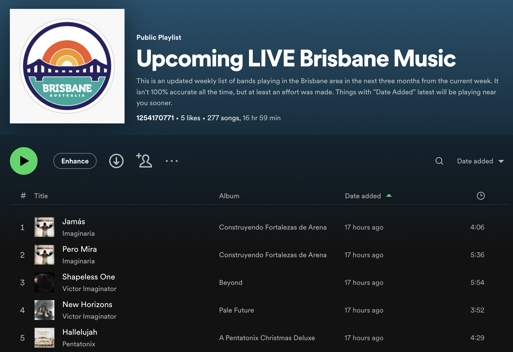
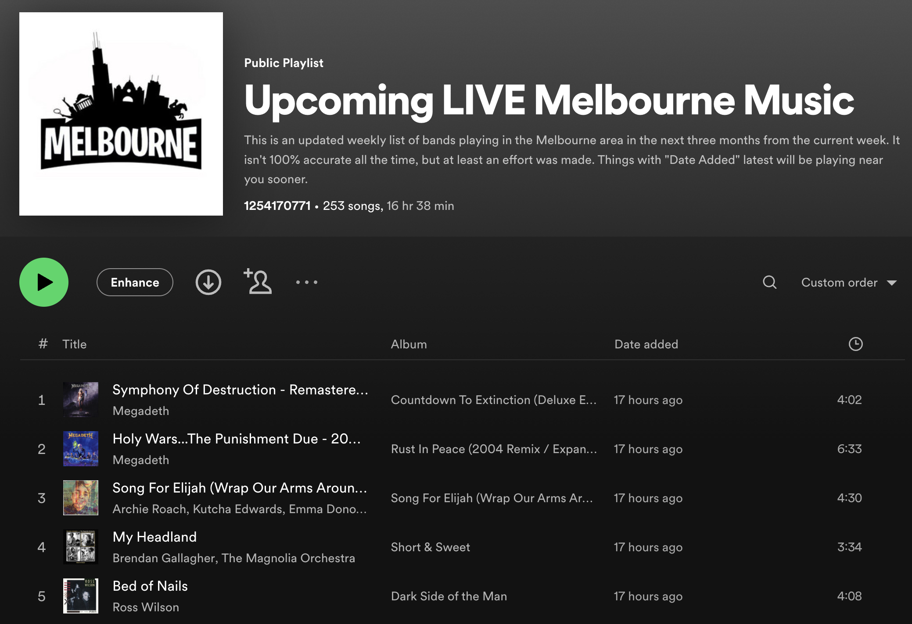
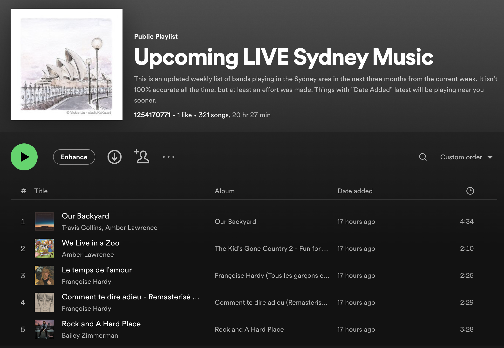
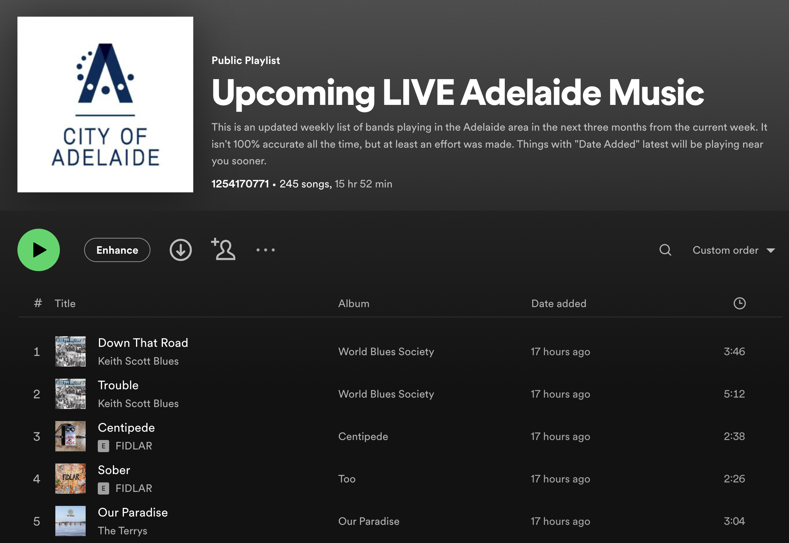

🎵 Gigpy
=================


Click on any of the following:

<table>
  <tr>
    <td><a href="https://open.spotify.com/playlist/3PjTtXAvsLe3C59USzfkni?si=54a5eb05b5d84d99"></a></td>
    <td><a href="https://open.spotify.com/playlist/4ctDUQ505YnGNoj21yYpxI?si=54a5eb05b5d84d99"></a></td>
  </tr>
  <tr>
    <td><a href="https://open.spotify.com/playlist/1Shh4ljWPQrcsvpTKtppm5?si=54a5eb05b5d84d99"></a></td>
    <td><a href="https://open.spotify.com/playlist/5FsF0m0y3J8DT9t5APliQH?si=54a5eb05b5d84d99"></a></td>
  </tr>
</table>

About
=====

This code updates playlists in Spotify based on upcoming music found in your local area.
The data source is [Bands In Town](https://www.bandsintown.com/). It should capture most bands, but maybe not all. If there is ambiguity over a band name for instance, it may mistakenly put the wrong band in the playlist -- sorry about that.

It should be rare and so the overwhelming majority are bands playing LIVE near you soon.

Enjoy =)

Requirements
============
* Spotify
* [spotipy](https://spotipy.readthedocs.io/en/2.22.1/)

Also set these environment variables in your `~/.bashrc` or whichever you're using. You can get these from Spotfiy [here](https://developer.spotify.com/dashboard/applications) but you also need to click "Edit Settings" for your app and add the redirect uri below:

```bash
export SPOTIFY_CLIENT_ID='SPOTIPY_CLIENT_ID'
export SPOTIFY_CLIENT_SECRET='SPOTIPY_CLIENT_SECRET'
export SPOTIFY_REDIRECT_URI='http://localhost:8899/callback'
export SPOTIFY_CLIENT_PLAYLISTID='SPOTIFY_CLIENT_PLAYLISTID'
export SPOTIFY_USER_ID='SPOTIFY_USER_ID'
```

Getting Started
======

You then need to ensure your cities are in the `cities.yaml` file. You can obtain the city ID by going to [bandsintown.com](https://www.bandsintown.com/this-week/genre/all-genres) and checking the URL for the the `city_id=2158177` tag.

```yaml
# cities.yaml
cities:
  - name: Brisbane
    id: 2174003                      # from bandsintown.com URL
    playlist: "3PjTtXAvsLe3C59Uabcd" # change to your own playlist
```

Then you can run:

```Python
import gigpy
gigpy.generate_playlists_for_city("Brisbane")
```

Ideally you run this in concept, not in actuality as it just duplicates what is already available. =)

Tested on Mac OS X 13.2.1 Ventura with Python 3.8. This should work on other
platforms, however.

Licence
=======

This project is licensed under the MIT License. See LICENSE for details.

