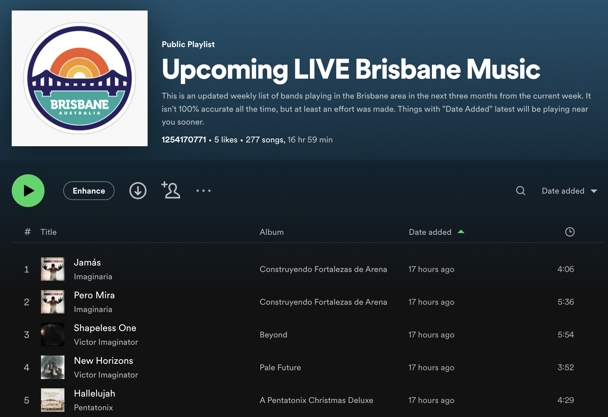
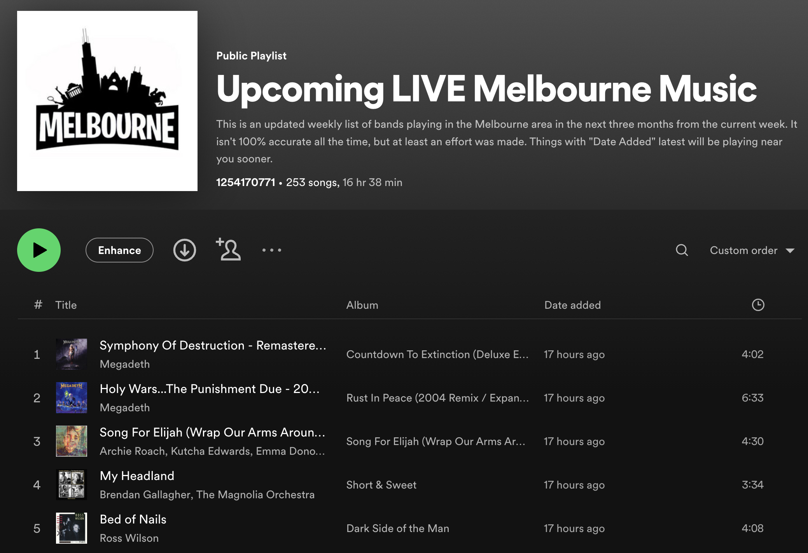
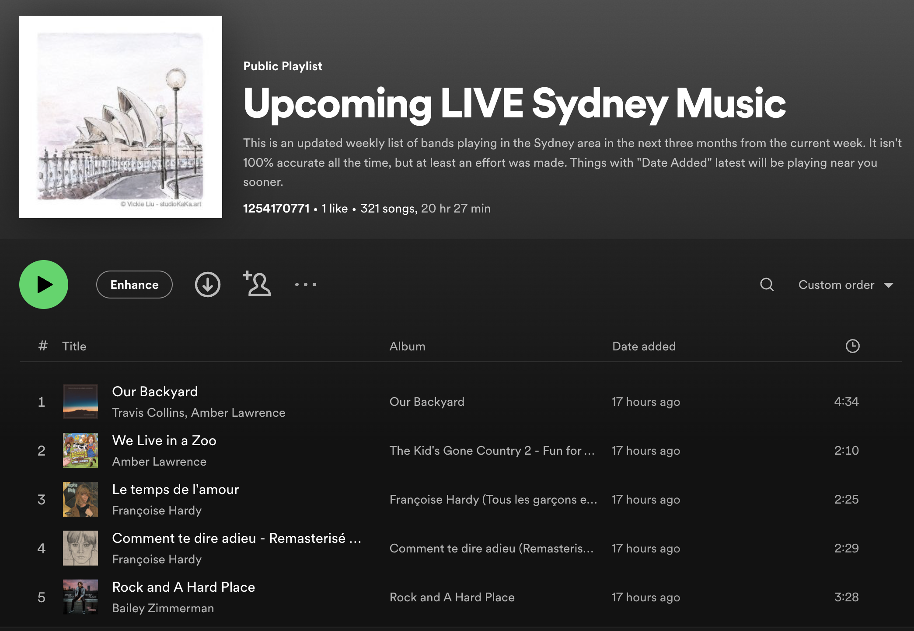
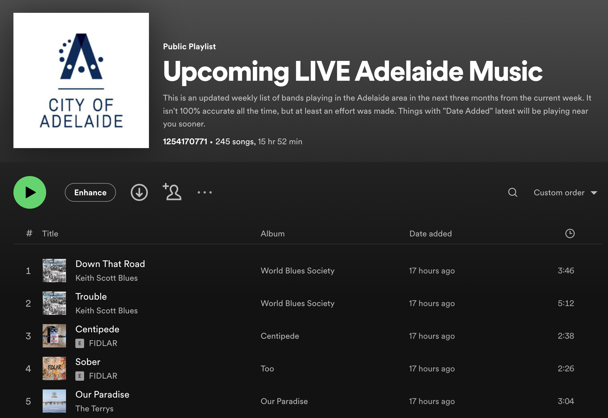

🎵 Spotify Local Bands
=================

About
=====

Code to find upcoming bands playing locally and convert their songs into a Spotify playlist. This uses BandsInTown which you can see inside `scrapebands.py`.

Requirements
============
* Spotify
* [spotipy](https://spotipy.readthedocs.io/en/2.22.1/)

Also set these environment variables in your `~/.bashrc` or whichever you're using. You can get these from Spotfiy [here](https://developer.spotify.com/dashboard/applications) but you also need to click "Edit Settings" for your app and add the redirect uri below:

```bash
export SPOTIFY_CLIENT_ID='SPOTIPY_CLIENT_ID'
export SPOTIFY_CLIENT_SECRET='SPOTIPY_CLIENT_SECRET'
export SPOTIFY_REDIRECT_URI='http://localhost:8899/callback'
export SPOTIFY_CLIENT_PLAYLISTID='SPOTIFY_CLIENT_PLAYLISTID'
export SPOTIFY_USER_ID='SPOTIFY_USER_ID'
```

Running
======

Once you have made the correct modifications, in `getlocalbands.py` and added those environment variables, you can just run:

```Python
python getlocalbands.py
```

Ideally you run this in concept, not in actuality as it just duplicates what is already available. =)

Tested On
=========
Tested on Mac OS X 13.2.1 Ventura with Python 3.8. This should work on other
platforms, however.


Listen In
=========

Click on any of the following:

<table>
  <tr>
    <td><a href="https://open.spotify.com/playlist/3PjTtXAvsLe3C59USzfkni?si=54a5eb05b5d84d99"></a></td>
    <td><a href="https://open.spotify.com/playlist/4ctDUQ505YnGNoj21yYpxI?si=54a5eb05b5d84d99"></a></td>
  </tr>
  <tr>
    <td><a href="https://open.spotify.com/playlist/1Shh4ljWPQrcsvpTKtppm5?si=54a5eb05b5d84d99"></a></td>
    <td><a href="https://open.spotify.com/playlist/5FsF0m0y3J8DT9t5APliQH?si=54a5eb05b5d84d99"></a></td>
  </tr>
</table>


